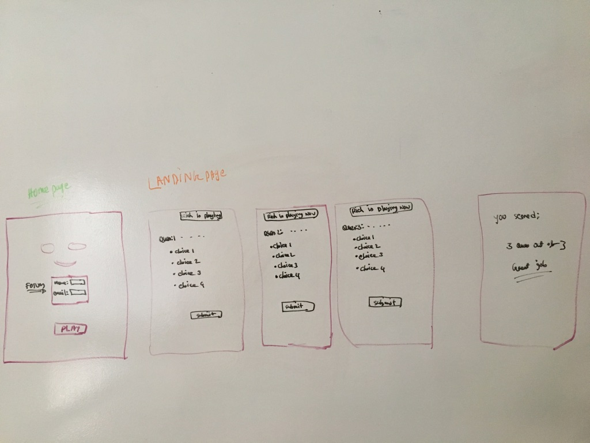

# The_Quest
==================
A trivia app
<!--  -->

***
## User Stories:
* Users want to be able to see a question on a page.
* Users should expect to see four choices to answer from.
* Users should see their names on the screen.
* Users should see a counter on the screen which will count the points.

***
## What is it?
* A trivia game
* It will render some questions.
* It is fun to play.

***
## Layout (Landing page)
* A landing page with a Smiley Face.
* A form to sign up the player for the game. 
* A button to play the game.

***
## Layout (Game Page)
* Questions
* Player name
* A counter

## Technologies Used:
* HTML
* CSS
* jQuery

## If you want to check the out the game:

[The Quest](https://www.bitballoon.com/sites/the-quest)

